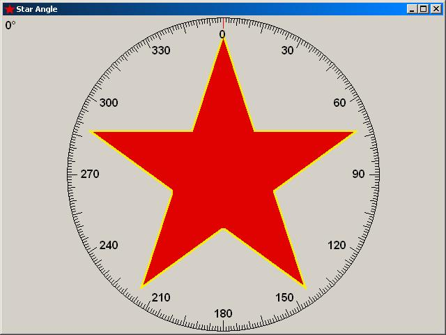



## DrawStar

### Description

This is a demo project showing how to draw a star of any size and at any angle on a Form or PictureBox. Also includes a geometry module with lots of useful functions.
 
### More Info
 

             |
---                |---
**Submitted On**   |2002-03-08 08:08:08
**By**             |[Steve Hardgrove](https://github.com/Planet-Source-Code/PSCIndex/blob/master/ByAuthor/steve-hardgrove.md)
**Level**          |Advanced
**User Rating**    |5.0 (40 globes from 8 users)
**Compatibility**  |VB 4\.0 \(32\-bit\), VB 5\.0, VB 6\.0
**Category**       |[Miscellaneous](https://github.com/Planet-Source-Code/PSCIndex/blob/master/ByCategory/miscellaneous__1-1.md)
**World**          |[Visual Basic](https://github.com/Planet-Source-Code/PSCIndex/blob/master/ByWorld/visual-basic.md)
**Archive File**   |[DrawStar60402382002\.zip](https://github.com/Planet-Source-Code/steve-hardgrove-drawstar__1-32461/archive/master.zip)

